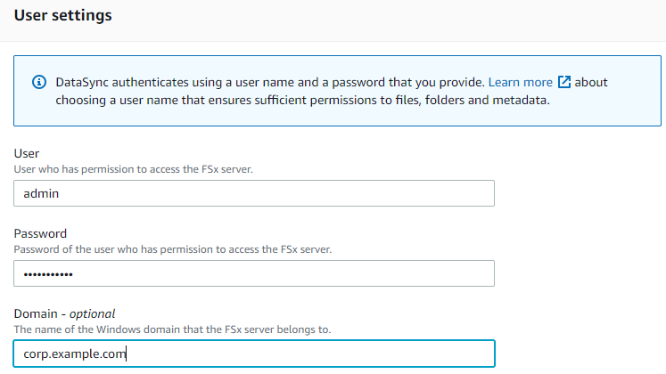
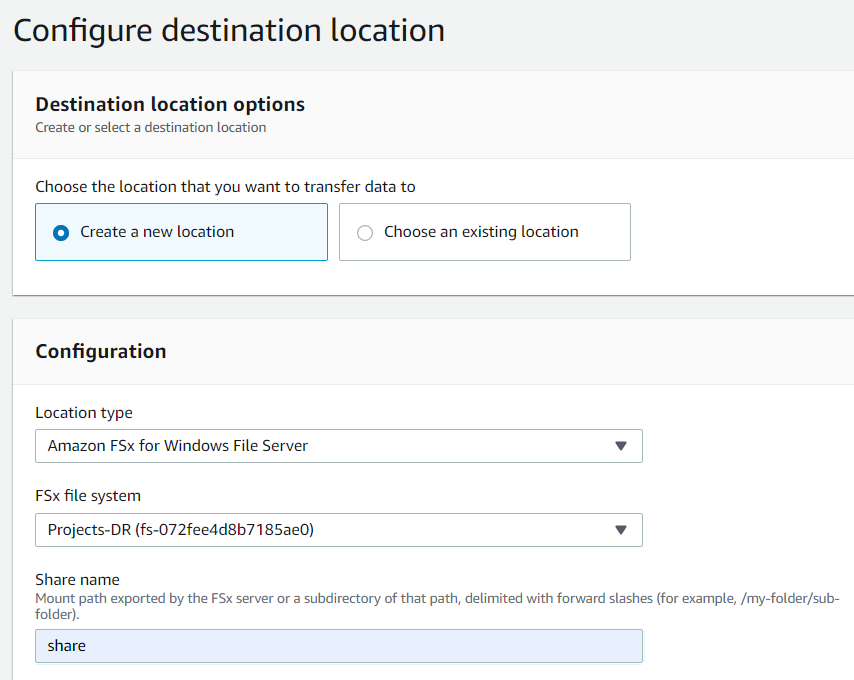
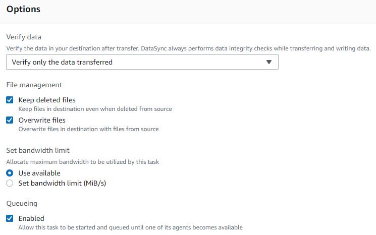
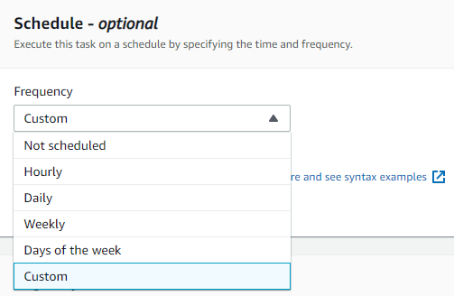

#### Acesse o console AWS

** **[Clique aqui para acessar o Console AWS:](https://console.aws.amazon.com/)** **

#### Etapa 0: Crie um AWS Managed Microsoft AD
Caso não tenha um AWS Managed Microsft AD criado, siga os passos abaixo:
1. Acesse a tela de criação do AWS Managed Microsoft AD: [https://console.aws.amazon.com/directoryservicev2/](https://console.aws.amazon.com/directoryservicev2/home?region=us-east-1#!/create)
2. Na página **Select directory type**, escolha a opção **AWS Managed Microsoft AD**. Clique em **Next**.
3. Na página, **Enter Directory information**, selecione a opção **Standard Edition**. Entre com o DNS name desejado **corp.example.com**. Digite uma senha para o administrador no campo **Admin password** e confirme no campo **Confirm Password**. Clique em **Next**.
4. Na página **Choose VPC and subnets**, seleciona a VPC, nesse exercício iremos utilizar a VPC padrão. Clique em **Next**.
5. Na página **Review & create**, clique em **Create directory**.
   
Aguarde até que o diretório tenha sido criado, esse processo pode levar de 20 a 40 minutos.

#### Etapa 1: Configure o Amazon FSx for Windows File Server na região origem (N. Virginia)

Assumindo que você ainda não tenha criado uma instância de Amazon FSx, essa é a primeira etapa para provisionar um sistema de arquivos para o **Windows File Server**.

1. Acesse a console do Amazon FSx: [https://console.aws.amazon.com/fsx/](https://console.aws.amazon.com/fsx/)
2. Selecione **Create file system** para iniciar a criação do sistema de arquivos
3. Na página **Select file system type**, escolha **Amazon FSx for Windows File Server**, e clique em **Next**. 
4. Na página **Create file system**, na seção **File system datails**, digite um novme para o sistema de arquivos. 
5. No **Deployment type** selecion **Multi-AZ**. Entre com a quantidade de disco desejada **32** GB. 
6. Na seção **Windows Authentication**, marque a opção **AWS Managed Microsoft Active Directory**. E selecione o nome do diretório criado anteriormente. Clique em **Next**. 
7. Na página **Create file system**, clique em **Next**.

{}
Enquanto o novo sistema de arquivos é criado, você pode executar a Etapa 2.
{}

### Etapa 2: Habilite a comunicação entre regiões AWS

Essa etapa está dividida em duas partes:
1. Habilitar a comunicação entre regiõesenabling network 
2. Modificar o AWS Security Group para permitir a comunicação entre as VPCs.

A configuração de redes deve permitir a comunicação entre as regiões AWS utilizadas. Duas formas comuns para habilitar a comunicação entre regiões, são: **[Virtual Private Cloud (VPC) peering](https://docs.aws.amazon.com/vpc/latest/peering/what-is-vpc-peering.html)** and **[AWS Transit Gateway](https://aws.amazon.com/transit-gateway/)**.

Nesse exercício usaremos o **VPC peering** pela simplicidade de configuração.

#### Etapa 2.1: Criando o VPC Peering

1. Acesse a console do Amazon VPC: [https://us-east-1.console.aws.amazon.com/vpc/](https://console.aws.amazon.com/vpc/home?region=us-east-1#)
2. No menu lateral esquerdo, escolha a opção **Peering Connections**
3. Na página **Peering Connections**, clique em **Create Peering Connection**
4. Na página **Create Peering Connection**, digite o name tag: **Virginia-Oregon**. No campo VPC (Requester), selecione a VPC padrão. Na seção **Select another VPC to peer with**, selecione a opção **Another Region** e seleciona região **US West (Oregon) (us-west-2)**. Para obter o VPC ID, acesse a console do Amazon VPC na região **Oregon**:
[https://us-west-2.console.aws.amazon.com/vpc/](https://us-west-2.console.aws.amazon.com/vpc/home?region=us-west-2#)
5. Clique em **Create Peering Connection**

{}
As VPC's devem usar endereços de IP diferentes, verifique o CIDR de cada uma.
{}

1. Acesse a console do Amazon VPC na região **Oregon**:
[https://us-west-2.console.aws.amazon.com/vpc/](https://us-west-2.console.aws.amazon.com/vpc/home?region=us-west-2#)
2. No menu lateral esquerdo, escolha a opção **Peering Connections**
3. Na página **Peering Connections**, selecione a **Peering Connection** com o status **Pending Acceptance**. Clique em **Actions -> Accept Request** e confirme.
4. Verifique que o status mudará para **Active**.

Each Amazon FSx for Windows File Server has a security group that controls what hosts (IP addresses) are allowed to access it. Update the security group protecting the Amazon FSx file system in the source Region by adding the IP address range for the DR AWS Region. Also, after creating the Amazon FSx file system in the DR Region, you must modify its security group to allow communications from the IP address range in the source AWS Region.

### Etapa 3: Set up Amazon FSx for Windows File Server in your DR Region

The second step is to create an Amazon FSx for Windows File Server file system in the DR AWS Region. You can follow similar steps as you did to create the Amazon FSx file system in the source Region. However, if you are using the **[AWS Management Console](https://aws.amazon.com/console/)**, change the AWS Region that you are operating in to the Region where you want to create the DR Amazon FSx file system. Do this before you start creating the Amazon FSx file system

You should join the file system to the same Active Directory as the source Amazon FSx file system so that the file permissions are the same. The result is that your users have the same file access.

For the Amazon FSx file system in the DR Region, you may decide to use the same specifications as your source Amazon FSx file system (for example, Multi/Single-AZ, storage type, storage size, and throughput). Depending upon your requirements, you may decide to use a different specification. The previous factors (Multi/Single-AZ, storage type, storage size, and throughput) drive the cost of running Amazon FSx. At a minimum, you should match the storage sizes of the source and DR file systems so that the DR file system can hold the data in the source file system. For more information on Amazon FSx pricing, please see the **[documentation](https://aws.amazon.com/fsx/windows/pricing/)**.

### Etapa 4: Setting up AWS DataSync agent near your source data

The next step is to install the **[DataSync agent](https://docs.aws.amazon.com/datasync/latest/userguide/working-with-agents.html)**. AWS recommends installing the AWS DataSync agent as close in network connectivity to the source file system. The AWS DataSync agent reads the data from the source system and copies it to the AWS DataSync service in an efficient, high-speed manner. AWS provides an image that has this agent deployed on it. To install the AWS DataSync agent, log in to the AWS Management Console and navigate to the AWS DataSync service. Select the **Get started** button.

Currently, as shown in the following screenshot, AWS provides two options for deploying the agent, either a VMware image or an EC2 image. To support replication from one AWS Region to another AWS Region, we are to use the Amazon EC2 image.

You can select how you want to communicate from the DataSync agent to the DataSync service by selecting the service endpoint. The two most common options are to communicate over the internet using the public service endpoints or over a private connection using the **[VPC endpoints using AWS PrivateLink](https://docs.aws.amazon.com/datasync/latest/userguide/datasync-in-vpc.html)**.

For AWS DataSync transfers between AWS Regions, you would most likely select the private connection using VPC endpoints to keep the replication traffic over a private connection. However for brevity of this lab, it's not necessary add the complexity of creating the VPC endpoints for this private connection (in this case). Thus, was selected the public service endpoints (see the following screenshot). However, if you want to use the private connection using VPC endpoints, please see our **[documentation](https://docs.aws.amazon.com/datasync/latest/userguide/datasync-in-vpc.html)**.

Once you deploy the agent, you must register the agent with the DataSync service by entering the name or IP address of the agent. Then press the Get key button.

To active the DataSync agent, make sure that the AWS Management Console can communicate with the DataSync agent. Once the DataSync agent registers successfully, you should see it listed in the console:

*For more on installing the DataSync agent information, please see the **[documentation](https://docs.aws.amazon.com/datasync/latest/userguide/configure-agent.html)**.*

### Etapa 5: Create the DataSync data replication task

The last step is to create the data replication task where you configure the source location, destination location, and migration settings. It is important to create the DataSync migration task in the same AWS Region as the target storage location (for example, in my scenario in the Oregon Region).

Open the AWS Management Console, and from the Region drop-down menu in the top right of the console, select the AWS Region where the DR Amazon FSx file system is created. Then navigate to the DataSync console and select the **Create task** button.

**Etapa 5.1: Specify the source location**

On the Configuration screen, you specify the source location options. For the Agent setting, select the DataSync agent that you installed in the prior step. Since you are replicating data from Amazon FSx, it is considered SMB file storage, so select the **Server Message Block (SMB)** option. For the SMB Server IP address, specify the **Preferred File Servier IP Address**, which can be found on the properties page of the Amazon FSx file system:

Specify the Windows file share on the server that you want to replicate. In my lab, my source Windows file server was at 10.0.22.151 and the **Share name** is share.

Next, specify the credentials of a user that has rights to read the data from the source location. A typical implementation is to create a service account that is a member of the Windows backup operators group and specify that service account. In this scenario, the source location is Amazon FSx, so make sure that the service account is a member of the **AWS Delegated FSx Administrators** group. For more information, please see our **[documentation](https://docs.aws.amazon.com/fsx/latest/WindowsGuide/limit-access-file-folder.html)**. The following screenshot shows all of the specifications already selected for the purposes of this example.

**Etapa 5.2: Specify the destination location**

For this step, specify the destination location where the data should be migrated. Under **Configure destination location** for the location type, specify the **Amazon FSx for Windows File Server** option. Select the Amazon FSx file system in the DR AWS Region that you created earlier and the share name where you want to copy the data.

You must also specify an account that has rights to write data to the Amazon FSx file system. To ensure sufficient permissions to files, folders, and file metadata, we recommend that you pick a user that is a member of the Amazon FSx file system’s delegated administrators group. For more information, please see our **[documentation](https://docs.aws.amazon.com/datasync/latest/userguide/create-fsx-location.html)**.

**Etapa 5.3: Specify the DataSync task settings**

On the next screen, you set the DataSync task settings, as shown in the following screenshot. Here are a couple suggestions on settings these items:

Since you are replicating the data to the DR AWS Region, verification of all the data in the destination every time the replication task is run is not required. Choose **Verify only the data transferred**. This change instructs AWS DataSync task to verify only the data transferred. For more information on each option, please see our **[user guide](https://docs.aws.amazon.com/datasync/latest/userguide/create-task.html)**.

* On the **Schedule** option (shown in the following screenshot), you can specify when you want the AWS DataSync task to run. For more information, please see our **[user guide](https://docs.aws.amazon.com/datasync/latest/userguide/task-scheduling.html)**.

**Etapa 5.4: Run the DataSync migration task**

Once you have specified the task setting and created the DataSync task, it then runs on the schedule that you specified. If you want to start the task immediately, you can do so by selecting the DataSync task and under **Actions**, select **Start**.

Now to check that the DataSync replication task is operating, logon to a Windows Server that has access to the Amazon FSx file system in the source and DR AWS Regions. Map a file share to the Amazon FSx file system in the DR AWS Region. If you need help with mapping a file share to the Amazon FSx file system, please see our **[documentation](https://docs.aws.amazon.com/fsx/latest/WindowsGuide/using-file-shares.html)**.

You should see your files appearing on the Amazon FSx file system as the AWS DataSync task copies the files. In the following screenshot, the file explorer on the left is my source file system and the one on the right contains the files on the Amazon FSx file system.

#### Apagando os recursos

Working in progess...

